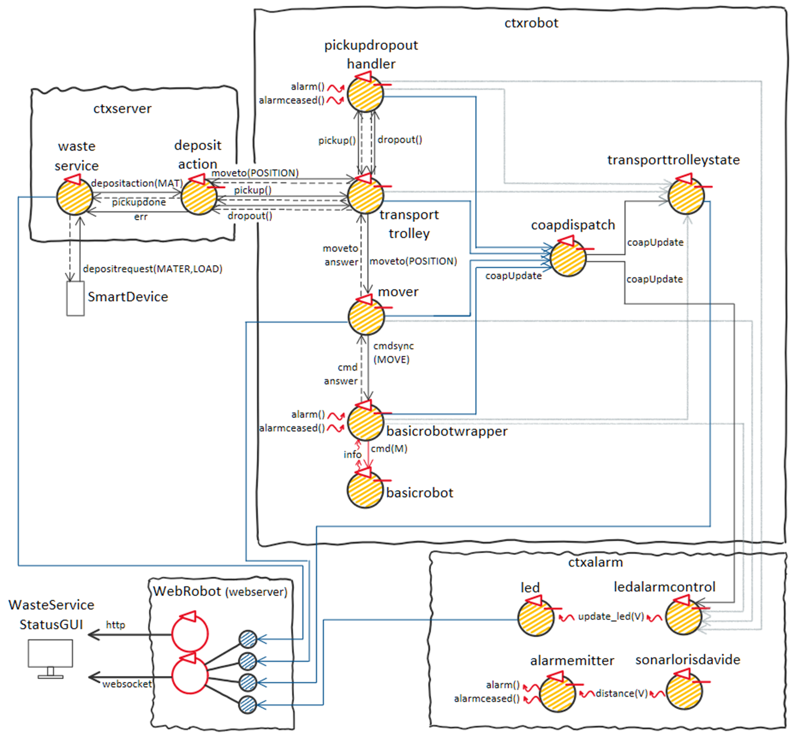
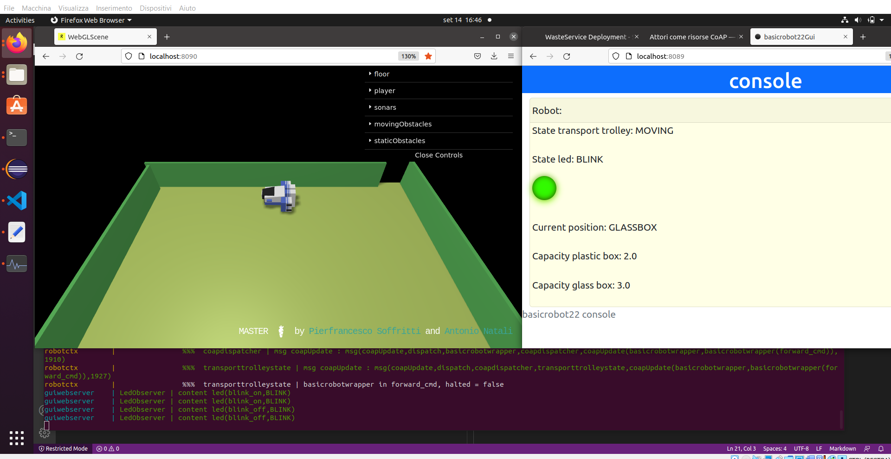
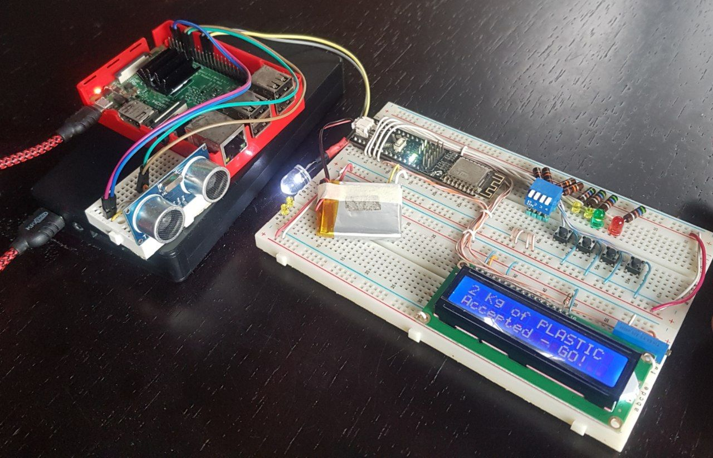

# "Ingegneria dei Sistemi Software" Final Project

This is the repository containing the project for the "Ingegneria dei Sistemi Software" course exam at Unibo. The project is aims to verify the methodology and technical skills acquired during the course regarding software production in an industrial scale.

The project start from the requisites given by the customer [here](docs_prof/html/TemaFinale22.html). Basically a robot, simulated in the given virtual environment, has to move across the area to load and unload different types of waste from the INDOOR to the proper container (PLATICBOX or GLASSBOX).

The application is developed using an iterative process, following the [SCRUM](https://scrumguides.org/) framework. 4 SPRINTs in total took place:
* [Sprint0](sprint0/sprint0.html)
* [Sprint1](sprint1/sprint1.html)
* [Sprint2](sprint2/sprint2.html)
* [Sprint3](sprint3/sprint3.html)

## some images of the prototype:

## Acquired competences:
Aside from having increased my designing capabilities, the project gave me the opportunity to explore or revisit many fundamental technologies like:
* Usage of the QActor metamodel, written by professor [Antonio Natali](https://github.com/anatali), to create models and automatically generate code as well as documentation images (using Eclipse Xtext)
* Message-driven and actor models
* Kotlin
* Spring
* Docker
* Gradle, Git, Intellij and other common developing tools
* CoAP and other network protocols
* Raspberry Pi & Arduino